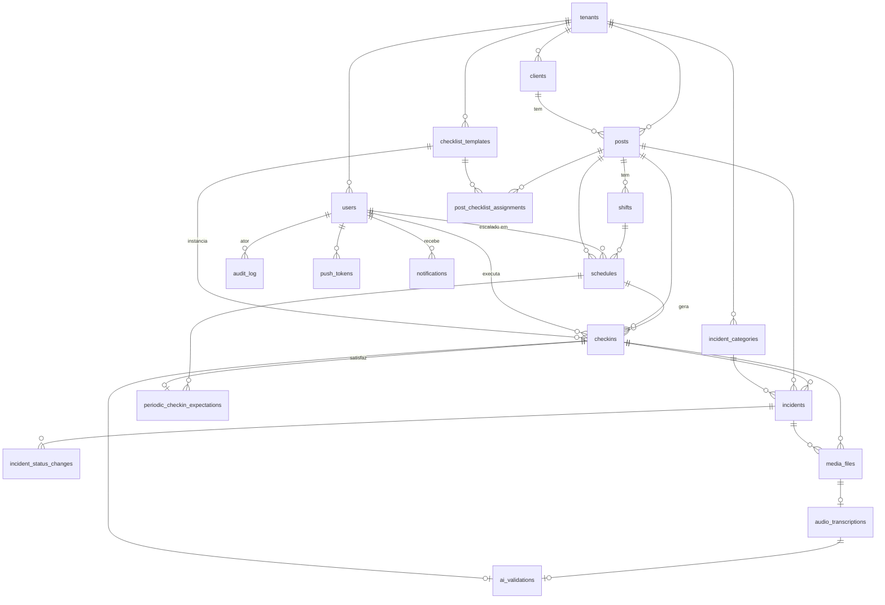

# Sistema Integrado — Modelagem de Dados

**Versão:** 0.1
**Data:** 13 de maio de 2026
**Status:** Em validação

> Modelagem para a Fase 1.1 (MVP de 14 semanas). Preparada para multitenancy (Fase 2) e para extensão a tipos Técnico/Monitoramento (Fase 1.2+).

---

## 1. Princípios desta modelagem

1. **Multitenancy preparada:** toda tabela carrega `tenant_id` desde o dia 1. RLS aplica isolamento. No MVP existe 1 tenant; em Fase 2 ativa multi-tenant sem migração de schema.
2. **Append-only para eventos operacionais:** check-ins, ocorrências, validações de IA não são editáveis. Correção = novo registro com `corrects_id` apontando para o original.
3. **Soft delete em cadastros:** `deleted_at` em entidades de cadastro. Preserva histórico (ocorrência feita por colaborador desligado continua referenciando ele).
4. **UUID v7 como ID:** não-sequencial, ordenável por tempo. Extensão `uuid-ossp` + função `uuid_generate_v7()` no Postgres.
5. **Timestamps `timestamptz` (UTC) + timezone do tenant** para apresentação.
6. **Enums como tabelas configuráveis,** exceto invariantes do domínio (estes como tipo Postgres).
7. **JSONB apenas onde o conteúdo é realmente variável** (ex: respostas de checklist preenchido).
8. **Índices criados junto com a tabela.** Não esperar lentidão.
9. **Naming:** snake_case, plural em tabelas, singular em colunas. FKs no padrão `<tabela_referenciada_singular>_id`.

---

## 2. Convenções de colunas comuns

Toda tabela tem (salvo justificativa):

| Coluna | Tipo | Default | Função |
|---|---|---|---|
| `id` | `uuid` | `uuid_generate_v7()` | PK |
| `tenant_id` | `uuid` | (obrigatório) | Isolamento multi-tenant |
| `created_at` | `timestamptz` | `now()` | Auditoria |
| `updated_at` | `timestamptz` | `now()` | Auditoria, trigger atualiza |
| `deleted_at` | `timestamptz` | `null` | Soft delete (só em cadastros) |

Tabelas de **eventos operacionais** (append-only) **não têm** `updated_at` nem `deleted_at`.

---

## 3. Domínios e tabelas

### Domínio A — Identidade & Acesso

#### `tenants`
Empresa de portaria que usa o sistema. No MVP existe 1 linha. Em Fase 2 vira multi-tenant.

| Coluna | Tipo | Notas |
|---|---|---|
| `id` | uuid PK | |
| `name` | text NOT NULL | "Empresa do Ryan", etc |
| `slug` | text UNIQUE NOT NULL | URL-friendly, ex: "empresa-do-ryan" |
| `timezone` | text NOT NULL | Default `'America/Sao_Paulo'` |
| `cnpj` | text | |
| `created_at` | timestamptz | |
| `updated_at` | timestamptz | |
| `deleted_at` | timestamptz | |

**RLS:** somente service_role acessa. Usuário comum nunca vê outros tenants.

#### `users`
Pessoas com acesso ao sistema (admin web, supervisor, colaborador). Integra com `auth.users` do Supabase.

| Coluna | Tipo | Notas |
|---|---|---|
| `id` | uuid PK | Igual a `auth.users.id` do Supabase |
| `tenant_id` | uuid FK → tenants | |
| `full_name` | text NOT NULL | |
| `email` | text | Opcional para colaborador de campo |
| `phone` | text | |
| `role` | user_role NOT NULL | Enum: `admin`, `supervisor`, `field_worker` |
| `employee_code` | text | Matrícula interna (para login do colaborador) |
| `pin_hash` | text | Hash bcrypt do PIN do colaborador (NULL para admin/supervisor) |
| `last_pin_failed_at` | timestamptz | Para bloqueio temporário |
| `pin_failed_count` | int DEFAULT 0 | Contador de tentativas |
| `created_at` | timestamptz | |
| `updated_at` | timestamptz | |
| `deleted_at` | timestamptz | |

**Índices:**
- `(tenant_id, employee_code) UNIQUE WHERE deleted_at IS NULL` — matrícula única por tenant
- `(tenant_id, role)` — listar por tipo
- `(tenant_id, deleted_at)` — listar ativos

**Tipo enum:**
```sql
CREATE TYPE user_role AS ENUM ('admin', 'supervisor', 'field_worker');
```

**RLS resumida:**
- Admin do tenant: vê todos do mesmo tenant
- Supervisor: vê admin, outros supervisores e field_workers do mesmo tenant
- Field_worker: vê só a si mesmo

**Nota de design:** integração com `auth.users` do Supabase é via trigger — quando um `auth.users` é criado, um `users` correspondente é criado com role default. Para colaboradores de campo, o admin cria via interface, gera `auth.users` programaticamente com email sintético tipo `colaborador-{employee_code}@{tenant_slug}.local` (Supabase exige email, mas não precisa ser real).

---

### Domínio B — Cadastros Operacionais

#### `clients`
Cliente final da empresa de portaria (condomínio residencial).

| Coluna | Tipo | Notas |
|---|---|---|
| `id` | uuid PK | |
| `tenant_id` | uuid FK | |
| `name` | text NOT NULL | "Condomínio Residencial Acácias" |
| `cnpj` | text | |
| `address` | text | |
| `contact_name` | text | Síndico ou administradora |
| `contact_phone` | text | |
| `contact_email` | text | |
| `notes` | text | Observações operacionais |
| `created_at` / `updated_at` / `deleted_at` | timestamptz | |

#### `posts` (postos de trabalho)

| Coluna | Tipo | Notas |
|---|---|---|
| `id` | uuid PK | |
| `tenant_id` | uuid FK | |
| `client_id` | uuid FK → clients | |
| `name` | text NOT NULL | "Portaria Principal", "Subsolo G2" |
| `service_type` | post_service_type NOT NULL | Enum |
| `address` | text | |
| `latitude` | numeric(10,7) | Para validar geolocalização no check-in |
| `longitude` | numeric(10,7) | |
| `geofence_radius_m` | int DEFAULT 200 | Raio de tolerância em metros |
| `qr_code_token` | text UNIQUE NOT NULL | Token rotacionável que vai no QR |
| `qr_code_rotated_at` | timestamptz | Quando o token foi rotacionado |
| `active` | bool DEFAULT true | Pausar posto sem deletar |
| `created_at` / `updated_at` / `deleted_at` | timestamptz | |

**Tipo enum:**
```sql
CREATE TYPE post_service_type AS ENUM ('portaria', 'servicos_gerais', 'tecnico', 'monitoramento');
```

(No MVP só `portaria` e `servicos_gerais` são usados ativamente; os outros existem no enum mas não têm fluxo dedicado ainda.)

**Índices:**
- `(tenant_id, client_id)` — postos do cliente
- `qr_code_token UNIQUE` — busca rápida no check-in
- `(tenant_id, active, deleted_at)` — listar ativos

**Nota:** `qr_code_token` é tipo `'pt_a3f8...'` (com prefixo). Rotacionável via admin se houver suspeita de vazamento. QR Code imprimível regerado.

#### `shifts` (turnos do posto — configuração)
Configuração dos turnos padrão de cada posto. Ex: posto X tem turno diurno 06:00-18:00 e noturno 18:00-06:00.

| Coluna | Tipo | Notas |
|---|---|---|
| `id` | uuid PK | |
| `tenant_id` | uuid FK | |
| `post_id` | uuid FK → posts | |
| `name` | text | "Diurno", "Noturno" |
| `start_time` | time NOT NULL | "06:00" |
| `end_time` | time NOT NULL | "18:00" — pode passar da meia-noite, comparação trata isso |
| `periodic_checkin_interval_min` | int DEFAULT 120 | Frequência de check-in periódico em minutos |
| `created_at` / `updated_at` / `deleted_at` | timestamptz | |

#### `schedules` (escala)
Quem trabalha em qual posto, em qual turno, em qual dia. Modelo simples: uma linha por dia/posto/turno/colaborador.

| Coluna | Tipo | Notas |
|---|---|---|
| `id` | uuid PK | |
| `tenant_id` | uuid FK | |
| `post_id` | uuid FK | |
| `shift_id` | uuid FK | |
| `user_id` | uuid FK → users (role=field_worker) | |
| `scheduled_date` | date NOT NULL | Dia da escala |
| `status` | schedule_status DEFAULT 'planned' | Enum |
| `notes` | text | |
| `created_at` / `updated_at` | timestamptz | |

**Tipo enum:**
```sql
CREATE TYPE schedule_status AS ENUM ('planned', 'confirmed', 'replaced', 'cancelled');
```

**Índices:**
- `(tenant_id, scheduled_date)` — escala do dia
- `(tenant_id, user_id, scheduled_date)` — agenda do colaborador
- `(tenant_id, post_id, scheduled_date)` — quem está no posto hoje
- `(tenant_id, post_id, shift_id, scheduled_date) UNIQUE` — sem duplicata na mesma posição

**Nota de design (flexibilidade):**
- `status='replaced'` permite trocar colaborador sem reagendar tudo. Admin marca a escala original como `replaced` e cria nova com `user_id` diferente.
- O check-in **não consulta escala como autoridade** — qualquer colaborador autenticado pode fazer check-in em qualquer posto. Mas o sistema **registra a discrepância** (campo `unscheduled = true` no check-in) para o supervisor revisar. Isso evita travar a operação no caso de troca de última hora.

---

### Domínio C — Templates Configuráveis

#### `checklist_templates`
Modelo de checklist por tipo de posto.

| Coluna | Tipo | Notas |
|---|---|---|
| `id` | uuid PK | |
| `tenant_id` | uuid FK | |
| `name` | text NOT NULL | "Checklist Portaria Diurno Padrão" |
| `service_type` | post_service_type | Para qual tipo de posto se aplica |
| `version` | int DEFAULT 1 | Templates são versionados |
| `items` | jsonb NOT NULL | Array de itens (ver estrutura abaixo) |
| `active` | bool DEFAULT true | |
| `created_at` / `updated_at` / `deleted_at` | timestamptz | |

**Estrutura do JSONB `items`:**
```json
[
  {
    "id": "smartphone",
    "label": "Smartphone do posto",
    "type": "boolean",
    "required": true,
    "category": "equipamentos"
  },
  {
    "id": "lanterna",
    "label": "Lanterna",
    "type": "boolean",
    "required": true,
    "category": "equipamentos"
  },
  {
    "id": "situacao_geral",
    "label": "Situação geral do posto",
    "type": "text_or_audio",
    "required": true,
    "category": "observacoes"
  }
]
```

**Tipos suportados de item:** `boolean`, `text`, `number`, `select`, `text_or_audio`.

#### `post_checklist_assignments`
Liga `posts` a `checklist_templates`. Um posto pode ter um checklist diferente por turno.

| Coluna | Tipo | Notas |
|---|---|---|
| `id` | uuid PK | |
| `tenant_id` | uuid FK | |
| `post_id` | uuid FK | |
| `shift_id` | uuid FK NULLABLE | Se null = vale pra todos os turnos do posto |
| `checklist_template_id` | uuid FK | |
| `purpose` | checklist_purpose NOT NULL | `entry`, `periodic`, `exit` |
| `created_at` / `updated_at` | timestamptz | |

```sql
CREATE TYPE checklist_purpose AS ENUM ('entry', 'periodic', 'exit');
```

#### `incident_categories`
Categorias configuráveis de ocorrência.

| Coluna | Tipo | Notas |
|---|---|---|
| `id` | uuid PK | |
| `tenant_id` | uuid FK | |
| `name` | text NOT NULL | "Elevador com problema", "Lâmpada queimada" |
| `severity_default` | incident_severity DEFAULT 'medium' | |
| `notify_supervisor` | bool DEFAULT false | Push automático? |
| `active` | bool DEFAULT true | |
| `created_at` / `updated_at` / `deleted_at` | timestamptz | |

```sql
CREATE TYPE incident_severity AS ENUM ('low', 'medium', 'high', 'critical');
```

---

### Domínio D — Eventos Operacionais (APPEND-ONLY)

#### `checkins`
Núcleo. Cada check-in (de entrada, periódico ou saída) é uma linha.

| Coluna | Tipo | Notas |
|---|---|---|
| `id` | uuid PK | |
| `tenant_id` | uuid FK | |
| `post_id` | uuid FK | |
| `user_id` | uuid FK → users | |
| `schedule_id` | uuid FK NULLABLE | Vincula à escala se houver |
| `unscheduled` | bool DEFAULT false | True se o colaborador não estava escalado |
| `purpose` | checkin_purpose NOT NULL | Enum |
| `checklist_template_id` | uuid FK | Snapshot de qual template usou |
| `checklist_responses` | jsonb NOT NULL | Respostas preenchidas |
| `latitude` | numeric(10,7) | Posição no momento do check-in |
| `longitude` | numeric(10,7) | |
| `geo_accuracy_m` | numeric | Precisão do GPS reportada pelo aparelho |
| `geo_within_post` | bool | Calculado: dentro do `geofence_radius_m` do posto? |
| `selfie_storage_path` | text | Path no Supabase Storage (NULL se posto não exige) |
| `corrects_id` | uuid FK → checkins | Se este check-in corrige um anterior |
| `device_id` | text | Identificador do aparelho |
| `app_version` | text | Versão do app no momento |
| `client_created_at` | timestamptz | Quando foi criado no app (importante para offline) |
| `server_received_at` | timestamptz DEFAULT now() | Quando chegou no servidor |

```sql
CREATE TYPE checkin_purpose AS ENUM ('entry', 'periodic', 'exit');
```

**Sem `updated_at`. Sem `deleted_at`. Append-only.**

**Índices:**
- `(tenant_id, post_id, server_received_at DESC)` — últimos check-ins do posto
- `(tenant_id, user_id, server_received_at DESC)` — histórico do colaborador
- `(tenant_id, server_received_at DESC) WHERE geo_within_post = false` — exceções de geolocalização
- `(tenant_id, server_received_at DESC) WHERE unscheduled = true` — check-ins fora da escala

#### `incidents` (ocorrências)

| Coluna | Tipo | Notas |
|---|---|---|
| `id` | uuid PK | |
| `tenant_id` | uuid FK | |
| `post_id` | uuid FK | |
| `user_id` | uuid FK | Quem registrou |
| `incident_category_id` | uuid FK NULLABLE | Pode ser "outros" |
| `title` | text NOT NULL | Curto, gerado/sugerido pela IA ou digitado |
| `description` | text | Texto livre ou transcrição editada |
| `severity` | incident_severity NOT NULL | |
| `latitude` / `longitude` | numeric | |
| `corrects_id` | uuid FK → incidents | |
| `client_created_at` | timestamptz | |
| `server_received_at` | timestamptz DEFAULT now() | |
| `status` | incident_status DEFAULT 'open' | Enum |

```sql
CREATE TYPE incident_status AS ENUM ('open', 'acknowledged', 'resolved', 'dismissed');
```

**Nota:** `status` é o único campo "editável" — admin/supervisor pode mudar pra `acknowledged`/`resolved`. Mas a edição vira **um registro novo em `incident_status_changes`** (append-only) para preservar auditoria.

#### `incident_status_changes`
Histórico append-only de mudanças de status de ocorrência.

| Coluna | Tipo |
|---|---|
| `id` | uuid PK |
| `tenant_id` | uuid FK |
| `incident_id` | uuid FK |
| `from_status` | incident_status |
| `to_status` | incident_status |
| `changed_by` | uuid FK → users |
| `comment` | text |
| `created_at` | timestamptz |

#### `periodic_checkin_expectations`
Janela esperada de check-in periódico, materializada para detectar atrasos.

| Coluna | Tipo | Notas |
|---|---|---|
| `id` | uuid PK | |
| `tenant_id` | uuid FK | |
| `post_id` | uuid FK | |
| `schedule_id` | uuid FK | |
| `expected_at` | timestamptz NOT NULL | Quando o check-in deveria acontecer |
| `window_min` | int DEFAULT 15 | Tolerância em minutos antes/depois |
| `fulfilled_by_checkin_id` | uuid FK → checkins | Preenchido quando o check-in chega |
| `escalated_at` | timestamptz | Quando notificou supervisor por atraso |

**Como é gerado:** trigger ou cron job materializa as expectativas para o dia com base em `shifts.periodic_checkin_interval_min` e `schedules` do dia.

**Por que materializar?** Permite consulta direta tipo "quais expectativas estão pendentes há mais de 15 minutos?" sem cálculo complexo a cada query. Trade-off de espaço por simplicidade.

---

### Domínio E — IA & Mídia

#### `media_files`
Arquivos enviados (áudios, fotos). Referência ao Supabase Storage.

| Coluna | Tipo | Notas |
|---|---|---|
| `id` | uuid PK | |
| `tenant_id` | uuid FK | |
| `kind` | media_kind NOT NULL | Enum |
| `storage_path` | text NOT NULL | Path no Supabase Storage |
| `mime_type` | text | |
| `size_bytes` | bigint | |
| `duration_ms` | int | Para áudio |
| `uploaded_by` | uuid FK → users | |
| `linked_entity_type` | text | 'checkin' / 'incident' |
| `linked_entity_id` | uuid | ID do checkin ou incident |
| `audio_expires_at` | timestamptz | Quando o áudio deve ser apagado (kind=audio) |
| `audio_purged` | bool DEFAULT false | True após cron apagar |
| `created_at` | timestamptz | |

```sql
CREATE TYPE media_kind AS ENUM ('audio', 'photo');
```

**Política de retenção (do documento 04):**
- `kind=audio`: 90 dias, depois cron apaga do Storage e seta `audio_purged=true`
- `kind=photo`: indefinidamente (sujeito a retenção geral do tenant — definida no Bloco 3 LGPD)

#### `audio_transcriptions`

| Coluna | Tipo | Notas |
|---|---|---|
| `id` | uuid PK | |
| `tenant_id` | uuid FK | |
| `media_file_id` | uuid FK → media_files | |
| `provider` | text | 'openai_whisper' |
| `model` | text | 'whisper-1' |
| `language` | text | 'pt-BR' |
| `transcript` | text NOT NULL | Texto transcrito |
| `confidence` | numeric | Score se disponível |
| `processing_time_ms` | int | |
| `cost_cents` | int | Custo da chamada em centavos |
| `status` | transcription_status DEFAULT 'pending' | |
| `error_message` | text | |
| `created_at` / `updated_at` | timestamptz | |

```sql
CREATE TYPE transcription_status AS ENUM ('pending', 'processing', 'completed', 'failed');
```

#### `ai_validations`
Validação semântica do checklist por GPT-4o-mini (módulo 8 do roadmap).

| Coluna | Tipo | Notas |
|---|---|---|
| `id` | uuid PK | |
| `tenant_id` | uuid FK | |
| `checkin_id` | uuid FK → checkins | |
| `transcript_id` | uuid FK → audio_transcriptions | |
| `provider` | text | 'openai' |
| `model` | text | 'gpt-4o-mini' |
| `missing_items` | jsonb | Array de IDs de itens não mencionados |
| `extracted_responses` | jsonb | Respostas estruturadas extraídas |
| `confidence` | numeric | |
| `prompt_tokens` | int | |
| `completion_tokens` | int | |
| `cost_cents` | int | |
| `status` | validation_status DEFAULT 'pending' | |
| `created_at` / `updated_at` | timestamptz | |

```sql
CREATE TYPE validation_status AS ENUM ('pending', 'completed', 'failed', 'manual_override');
```

---

### Domínio F — Auditoria & Notificações

#### `audit_log`
Log imutável de ações relevantes.

| Coluna | Tipo | Notas |
|---|---|---|
| `id` | uuid PK | |
| `tenant_id` | uuid FK | |
| `actor_user_id` | uuid FK | Quem fez |
| `action` | text NOT NULL | Ex: `'user.created'`, `'post.qr_rotated'`, `'incident.resolved'` |
| `entity_type` | text | Tipo da entidade afetada |
| `entity_id` | uuid | ID da entidade afetada |
| `metadata` | jsonb | Detalhes do que mudou (diff, payload, etc) |
| `ip_address` | inet | |
| `user_agent` | text | |
| `created_at` | timestamptz DEFAULT now() | |

**Append-only sempre.** Nenhuma operação de UPDATE/DELETE.

**Índices:**
- `(tenant_id, created_at DESC)` — log recente
- `(tenant_id, entity_type, entity_id, created_at DESC)` — histórico de uma entidade
- `(tenant_id, actor_user_id, created_at DESC)` — ações de um usuário

#### `push_tokens`
Tokens de Expo Push por dispositivo/usuário.

| Coluna | Tipo |
|---|---|
| `id` | uuid PK |
| `tenant_id` | uuid FK |
| `user_id` | uuid FK |
| `device_id` | text |
| `expo_push_token` | text NOT NULL |
| `platform` | text | 'android' / 'ios' |
| `active` | bool DEFAULT true |
| `created_at` / `updated_at` | timestamptz |

#### `notifications`
Notificações enviadas (registro para histórico).

| Coluna | Tipo |
|---|---|
| `id` | uuid PK |
| `tenant_id` | uuid FK |
| `recipient_user_id` | uuid FK |
| `kind` | text | Ex: 'incident.critical', 'periodic_checkin.overdue' |
| `title` | text |
| `body` | text |
| `payload` | jsonb |
| `delivery_status` | text | 'sent', 'failed', 'read' |
| `created_at` | timestamptz |

---

## 4. Diagrama ER (Mermaid)



---

## 5. RLS — Política geral

Para cada tabela com `tenant_id`:

```sql
CREATE POLICY tenant_isolation ON <tabela>
  USING (tenant_id = (auth.jwt() ->> 'tenant_id')::uuid);
```

`tenant_id` vai no JWT do Supabase via custom claim (configurado no auth hook).

Políticas por role:
- `field_worker`: pode INSERT em `checkins`, `incidents`, `media_files`; pode SELECT só nos próprios registros + posto atual
- `supervisor`: SELECT em quase tudo do tenant; UPDATE limitado a `incidents.status` (via função SECURITY DEFINER que gera `incident_status_changes`)
- `admin`: SELECT/INSERT/UPDATE/DELETE em cadastros; SELECT em eventos
- `service_role` (backend/Edge Functions): bypass RLS

---

## 6. Considerações operacionais

### Backups
- Supabase Pro: backup diário automático, retenção 7 dias
- **Pendente:** definir se exportamos snapshot semanal para outro storage (não imediato no MVP)

### Tamanho estimado em 12 meses
- ~100k check-ins × ~3KB = ~300MB
- ~30k ocorrências × ~2KB = ~60MB
- ~15GB de áudio (compensado por purge de 90 dias → estado estável ~4GB)
- ~25GB de fotos (após compressão)
- **Total: ~30GB**, dentro dos 100GB do Supabase Pro.

### Migrations
- Toda mudança de schema via arquivo SQL versionado em `supabase/migrations/`
- Naming: `YYYYMMDDHHMMSS_description.sql`
- Reversíveis quando possível (não obrigatório no MVP)

### Seeds para desenvolvimento
- Script `seed.sql` cria 1 tenant, 2 admins, 3 supervisores, 10 colaboradores, 5 clientes, 12 postos com QR Code, templates de checklist padrão.

---

## 7. Pendências / decisões em aberto

1. **Política de retenção geral** (além do áudio) → Bloco 3 LGPD
2. **Política de senha do admin/supervisor** (complexidade, expiração) → Bloco 3
3. **Tipo de hash do PIN** → bcrypt cost 10 é decisão preliminar
4. **Estratégia de envio offline** → será detalhada no documento de arquitetura técnica (08)
5. **Como expor/processar `latitude`/`longitude`** sem ferir LGPD → o sistema **só captura no momento do check-in**, não em background. Já alinhado, mas registrar formal no documento de LGPD.
6. **Custos de IA por tenant** — quem paga em Fase 2? → adiar para spec de SaaS
7. **Estratégia de queue para transcrição/validação** → arquitetura técnica (Edge Functions + retry)
